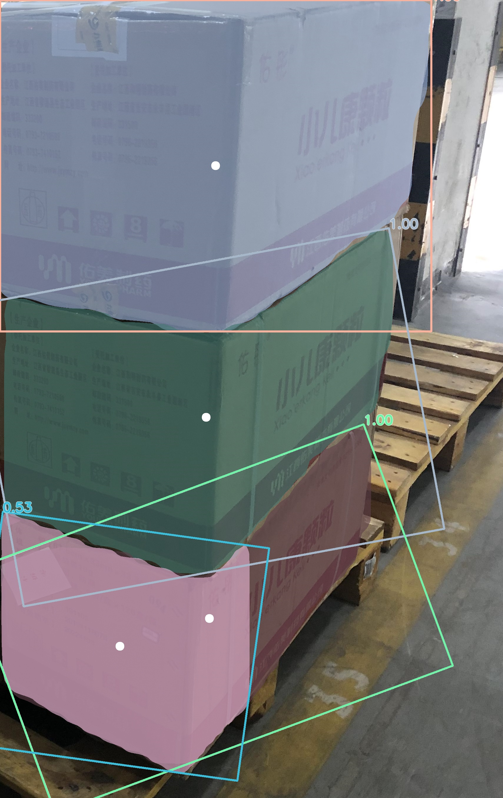

# Autonomous Parcel Unloading from Truck Containers

CNN detects stacked parcels, mecanum base navigates, 7-DOF arm picks and places onto pallet — fully autonomous in Gazebo simulation.

## Demo


## Detection Results (Mask R-CNN, segm AP 90.7)

| Warehouse Stacking | Dense Mixed Cartons | Uniform Stacking | Close-up View |
|---|---|---|---|
| _vis.jpg) | _vis.jpg) | _vis.jpg) |  |

## System Overview

```
RGB-D Camera
    |
Mask R-CNN (Detectron2)  -->  Instance masks + depth  -->  3D world coordinates
    |
Pick Strategy (top-right first)
    |
Dijkstra Path Planner (2D grid, 0.25m)  -->  Obstacle-free waypoints
    |
PID Base Controller (cmd_vel + odom)  -->  Navigate to box front
    |
Pinocchio IK (7-DOF, damped least-squares)  -->  Arm reaches box
    |
Contact Verify (actual joint feedback, < 5cm)  -->  Suction ON
    |
Dijkstra Navigate to Pallet  -->  Arm swings backward  -->  Release
```

## Key Specs

| | |
|---|---|
| **Detection** | Mask R-CNN, two-stage transfer (OSCD pretrain → LSCD finetune), AP 90.7 |
| **Arm** | Franka 7-DOF, Pinocchio IK, ROS joint_state feedback, positioning < 5cm |
| **Base** | Mecanum omnidirectional, PID on world coordinates, Dijkstra path planning |
| **Suction** | Gazebo DetachableJoint, spawn at fer_link7 (zero-offset attach) |
| **Stack** | ROS 2 Humble, Gazebo Harmonic, CycloneDDS, ros_gz_bridge |

## Repositories

| Repository | Description |
|---|---|
| [**truck-unload-robot**](https://github.com/CHANGJianshuo/truck-unload-robot) | Robot system: URDF, control, path planning, demo orchestration |
| [**parcel_detection**](https://github.com/CHANGJianshuo/parcel_detection) | Mask R-CNN training: dataset, two-stage transfer learning, inference |

## License

MIT
